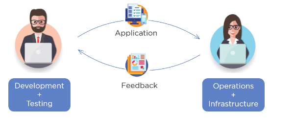
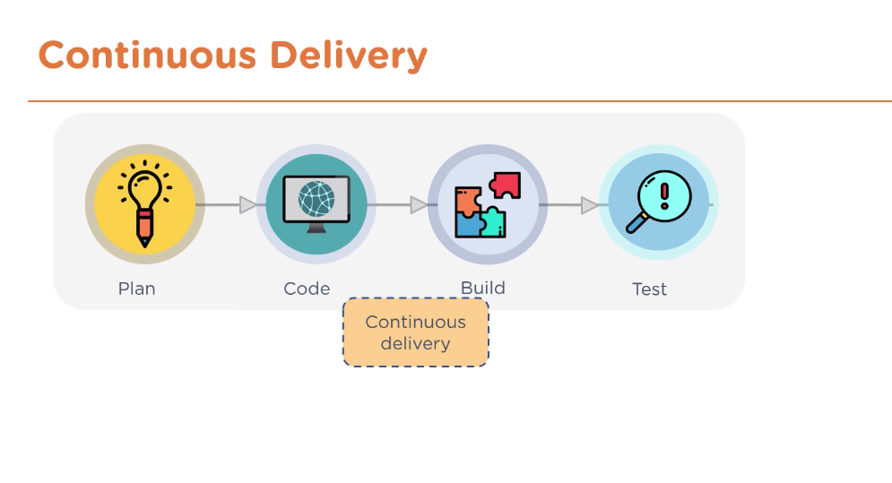
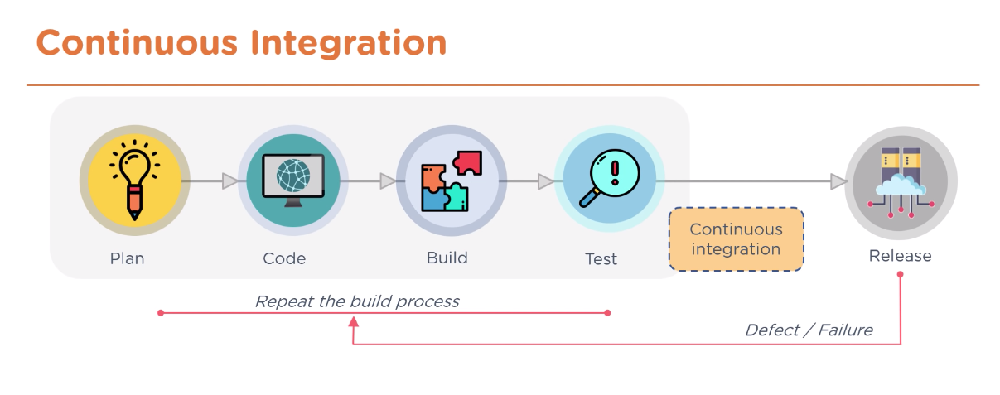
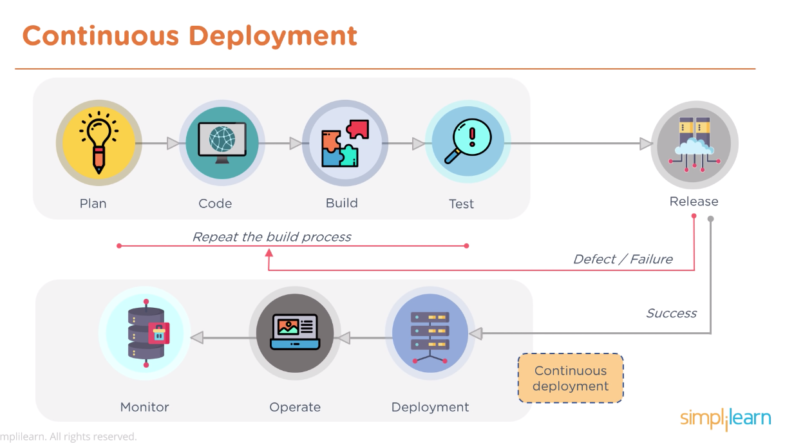

## DevOps

Developers and Operations Team working together for successful continuous delivery.

**DevOps** is an evolution from [Agile](./WaterfallAgile.md) model of Software Development.

Agile model is good for gathering requirements and addressing gap between clients and developers.

DevOps brings together Dev+Testing & Ops+Infrastructure Teams into single team. Can build solutions which is being tested in production-like environment. Ops team can analyse the environment and make suggestions for adjustments to code, based on data.

8 phases of DevOps cycle:

1. **Plan** - scope requirements with the clients
2. **Code** - design and code application. Use Git to collaborate
3. **Build** - use tools such as Maven to consistently build out environment
4. **Test** - scripted Testing
5. **Integrate** - Use Jenkins for new features to be integrated automatically
6. **Deploy** - software packaged and deployed from development server to production
7. **Operate** - once software is deployed, ops team perform activities such as configuring servers
8. **Monitoring** - identify any issues

**Advantages**

- Time taken to create and deliver software is reduced
- Complexity of maintaining application is reduced
- Improved collaboration between developers and operations team
- Continuous integration and delivery ensure faster time to market
