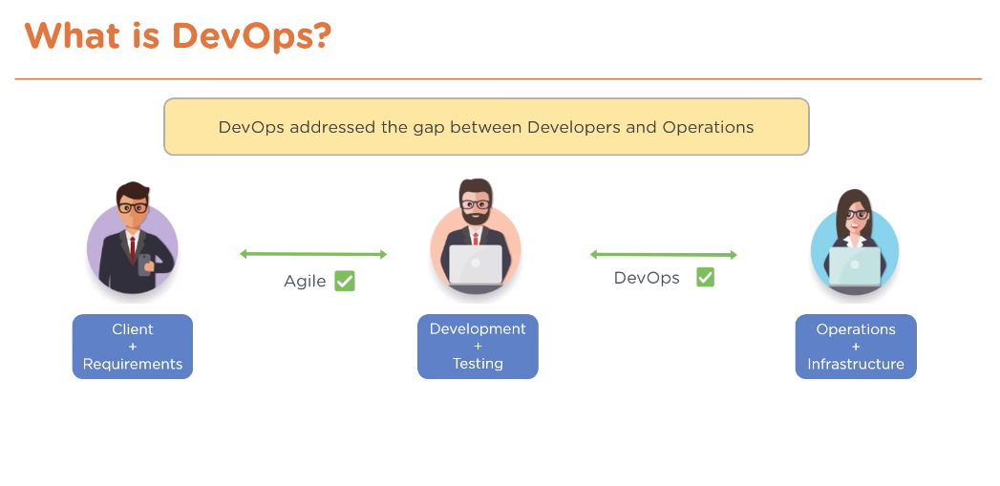

## DevOps

Developers and Operations Team working together for successful continuous delivery.

**DevOps** is an evolution from [Agile](./WaterfallAgile.md) model of Software Development.

Agile model is good for gathering requirements and addressing gap between clients and developers.

DevOps brings together Dev+Testing & Ops+Infrastructure Teams into single team. Can build solutions which is being tested in production-like environment. Ops team can analyse the environment and make suggestions for adjustments to code, based on data.

