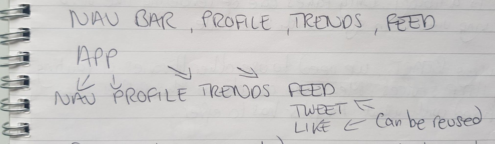

# React Fundamentals

- React is a JavaScript library for building user interfaces
- Considered one of the most popular JS libraries. Others include Angular and Vue

React is centred on **Components** - A piece of the UI

- When building, we create independent reusable components and then compose them to build complex user interfaces.

- Every React application has at least one component which we refer to as the **root component**. This represents the application and contains other child components. An example tree of components:

A Component is implemented as a JavaScript class which has **state** and a **render** method:

